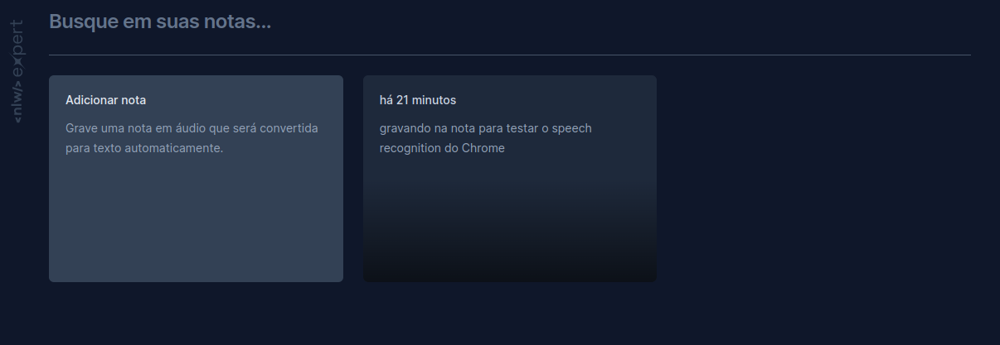

# NLW Expert (React)

This application was developed during the Rocketseat's NLW Experts using Vite, React, TypeScript, Tailwind and the SpeechRecognition API.

You can see the application running [here](https://juliamendesc.github.io/nlw-expert-notes/).

## Getting Started

If you want to run and play with this application locally, you need to have Node.js installed on your machine. After cloning the repository, access the project folder and run the commands below:

```sh
npm install
npm run dev
```

Go to http://localhost:5173 to see the application.

## Learnings

- Vite
  This is the first time I used Vite to create a React application. It was a great experience and I loved the speed of the development server. It is also very easy to configure and use.

- SpeechRecognition API
  I had never used this API before and it was very interesting to learn how to use it. It is very simple to use and it is a great tool to create voice commands in web applications.

## Possible future improvements:

- [ ] Add clear all notes functionality
- [ ] Add save audio notes functionality
- [ ] Add edit note functionality
- [ ] Add delete note functionality
- [ ] Save notes in web storage
- [ ] Add tests
- [ ] Add CI/CD
- [ ] Add authentication

<br>

Made with ❤️ by [Julia Mendes](https://www.linkedin.com/in/juliamendesc/)
